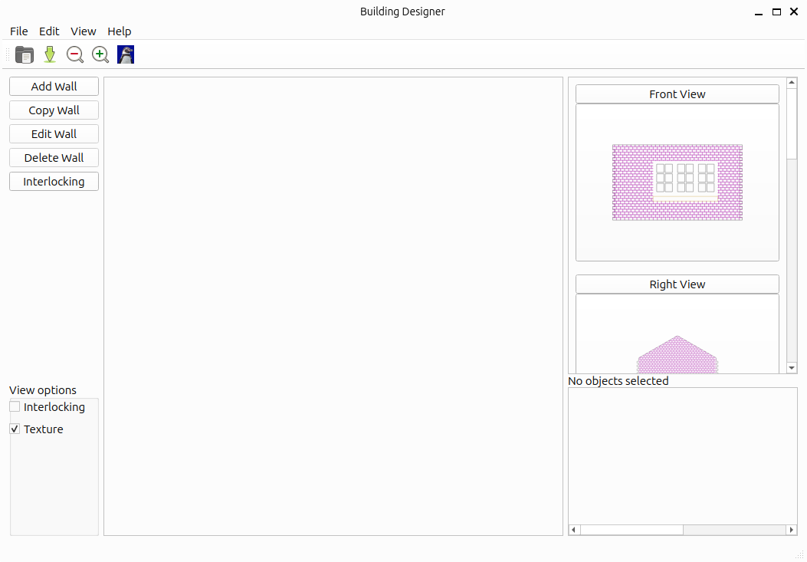
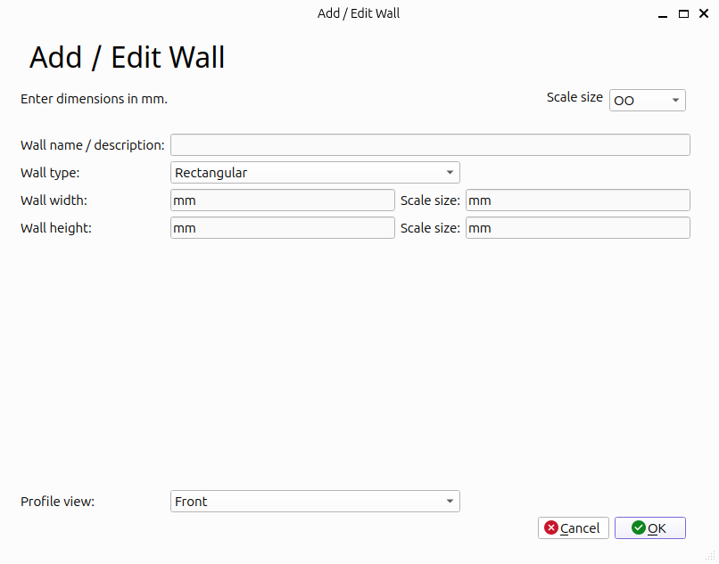
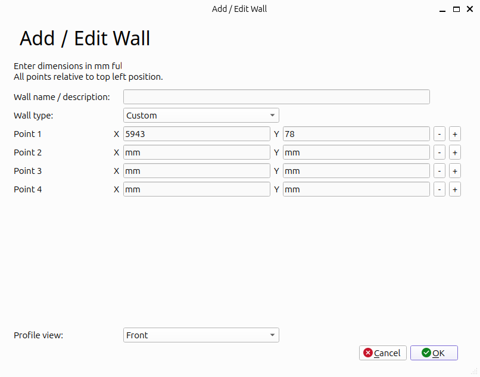
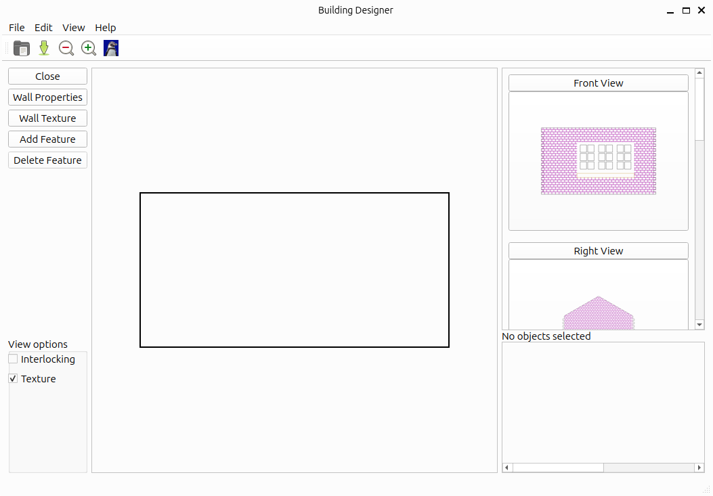

# lc-building User Guide for GUI building design application
LaserCut Model Building Creation Tool

## Important note
This is in a very early development stage. It has very limited functionality.
More details will be provided as the code is developed further.

## Install and Setup
Installation instructions are provided in the README.md file. 
To launch the program run:

    python3 building.py 
    

## Screen layout

This shows the initial screen when launching the application. The large central area is the edit area, this changes depending upon the selected view and whether performing an edit. The icons on the right are used to change the view (elevation) of the building and displays the walls associated with that view into the edit area. 

The bottom right provides more information about selected objects. Initially this is empty, but will be populated when a wall or other object is selected. 

There is an actions menu on the left with shortcuts to actions available. This is context sensitive and when in edit mode then the menu options change. 

The view options in the bottom left provides a way to display features. This doesn't effect the saved or exported objects. For performance reasons you may wish to turn off the Texture view when making major edits. 

### Adding a wall

To add a new wall click on the _Add Wall_ button, or chose Edit -> Add Wall.

This will launch the add wall window.

Except in custom mode the Scale Size can be selected in the top right. This will provide an indication of the scale size (export size) whilst on the Add Wall screen. The Scale Size is not saved and does not effect the model in any way.

There is a field to provide a wall name, or short description. This is optional, but highly recommended as it will make it easier to identify the appropriate wall. 

The wall type provides a way to create simple shapes (eg. rectangular or apex wall.), or select the Custom option to define the wall dimensions using points. Using the standard wall shapes allows the dimensions to be added as real world dimensions on the left, or as scaled down dimensions on the right. These are both in mm. For example for a 6m wide wall then enter 6000 in the left field, or if OO scale is selected that could be entered in the scale size field as 78mm (which is actually 5943mm). It doesn't make sense to be more accurate than 1mm when exported, but using the real dimension may be more accurate if creating models with different scales.

The profile view should then be selected and choose OK to create the wall. The actual wall will be converted into the custom type when created.

### Adding a wall (Custom)

Using the custom wall type allows the wall to be created using a polygon and x,y co-ordinates. The poinst should be entered from (0,0) in the top left, and should be in a clockwise direction. For a 6m x 3m rectangle use the following points:

* 0, 0
* 6000, 0
* 6000, 3000
* 0, 3000
* 0,0

(the final point is optional to return back to the start).
Additional points can be added or removed using the _-_ and _+_ buttons at the end of each row.

It is possible to edit the wall after creation, which will be done using the custom co-ordinates.

### Editing a wall

After a wall is created, to edit it then first select the wall by clicking on it (which will show in the bottom right), then click Edit Wall. 

The menu on the left will change so that you can see you are in edit wall mode.

Clicking on Wall properties will open the edit wall window where you can change the points. Note that if created using a standard shape the wall will have been converted to a custom points setup.

Choosing the Add Feature button will allow you to add from the list of example features (eg. doors and windows). These will be added to the wall in the top left and can then be moved to the appropriate position. 

Choosing the Add Texture button will allow you to apply a texture to the wall (eg. wood or brick). After selecting the appropriate texture you can set any parameters (suggested values are included on the right). 

To return to the main view click on the close button, or choose one of the other views from the view selection icons on the right hand side.

### Interlocking

Interlocking provides the ability to join walls using interlocking tabs. Each join needs two edges. One is designated primary, the other is secondary. The primary edge defaults to clockwise direction, or can be reversed by selecting reverse. The secondary edge is in the opposite direction and inverted resulting in interlocking tabs. The choice of reverse should normally be the same for both primary and secondary.

    
    
## Limitations

### Everything in mm
All measurements should be based on mm of actual size.
Conversation to scale mm and then to pixels is done within the
application. It may be possible to add an interface to allow 
other units (eg. inches) to be used as an input, but they will
still be handled internally as mm.

### Overlapping etches
Some laser cutting software does not allow overlapping etches.
In the case of Lightburn it will not output any parts that overlap.
This is a limitation of the laser cutting software rather than this 
program.

It is recommended that you allow overlaps within this software and
then use the appropriate feature in the laser burning software. 
For example in Lightburn you will need to use the weld feature, or
you could edit in Inkscape. 

When creating templates it is much simpler to allow overlapping etches. 
Particularly when different scales can produce rounding errors when scaling
is applied.
For example shed hinges that overlap with the texture. It also helps with
etches that are padded into polygons as otherwise those would need to be
taken into consideration.

### Limitations of small scales
Small scales (smaller than HO/OO) may have problems when dealing with small
size shapes. These may need to be edit in Inkscape before burning, or choose
an "N friendly" template

### Single texture per wall
Currently only allows a single texture per wall which covers entire wall.
For split walls (eg. half brick half render) then split into multiple walls
